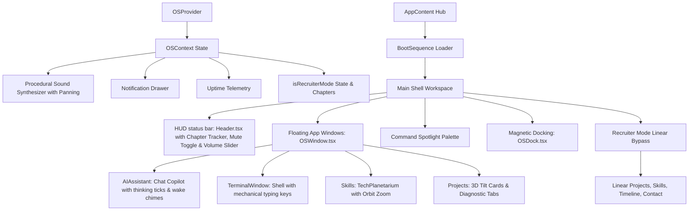

# COMPLETED: AI Operating System Portfolio Finalization Summary (Version 3.0)

This document logs all achievements, bug fixes, optimization sweeps, and cinematic feature implementations completed to evolve the **Sanjaikumar P K Portfolio** into an immersive, production-ready **"Digital Universe" (Version 3.0)**.

---

## 🛠️ Unified Accomplishments (V3.0 Upgrade)

### 1. 🔊 Premium Web Audio Synthesizer Engine (`OSContext.tsx`)
* **Procedural Synthesis Logic**: Replaced all hardcoded assets with real-time browser-synthesized audio nodes (Oscillators, Gain nodes, LFOs, and StereoPanners) to respect browser autoplay policies, initialize upon first click, and maintain 60+ FPS performance.
* **Spatial Stereo Panning**: Attenuates sound balance dynamically based on screen horizontal coordinates (`pan` value calculated from `-1.0` to `+1.0`), placing chimes in the listener's virtual space.
* **Volume Slider Control & Memory**: Added a volume state (`volume`) ranging from `0` to `1.0`, bound to a range slider in the Header HUD, persisting preferences inside `localStorage` (`sanjai_os_volume`).
* **Keyboard Mute Toggle Shortcut**: Bind key `'M'` or `'m'` globally to toggle mute state immediately, unless typing in a terminal or search input field.
* **Ambient OS Breathing Hum**: Initiates a C2-note oscillator (65.41 Hz) modulated by a slow LFO (0.25 Hz) to act as a futuristic ambient server room background hum.
* **Unified Soundscape Cues Catalog**:
  * `click` - Low-latency triangle drop for standard buttons.
  * `tap` - Short sine click for progress ticks.
  * `shutdown` - Descending frequency drop.
  * `open` - Double-note ascending glass chime.
  * `nav` - Rapid high-frequency navigation transition.
  * `dockHover` - Subtle high sine beep.
  * `sparkle` - Sparkling arpeggio cascade.
  * `expand` - Ascending pitch expansion.
  * `transform` - Wide-sweep transformer noise for recruiter mode.
  * `success` - Elegant four-note arpeggio chord.
  * `error` - Sawtooth warning tone.
  * `type` - Tactile mechanical typing click.
  * `return` - Lower mechanical click for enter/return keys.
  * `wake` - Futuristic copilot waking tone.
  * `thinking` - Repeating low-volume processing cycle tick.
  * `ping` - Quick spotlight diagnostic ping.
  * `boot` - Deep sub-bass sweep overlaid with rising chords.

### 2. ⚡ Interactivity Audio Integrations
* **Rhythmic Boot Loader (`App.tsx`)**: The boot progress bar plays soft `tap` ticks when printing logs, random `dockHover` ticks to indicate background processing, and finishes with a grand `boot` arpeggio chime.
* **Interactive CLI Shell (`TerminalWindow.tsx`)**: Plays click-like `type` sounds on keyboard input, a satisfying `return` chime on execute, and reports command outcomes with `success` or `error` sound cues.
* **AI Copilot Agent (`AIAssistant.tsx`)**: Triggers `wake` upon loading, a repeating `thinking` audio tick (every 320ms) while simulating response generation, and alerts completion with a soft success chime.
* **Spotlight Command Palette (`CommandPalette.tsx`)**: Triggers mechanical typing ticks and plays scrolling hover `dockHover` ticks when navigating commands list using arrow keys.
* **Workspace Window Stack (`App.tsx`)**: Plays opening glass chimes (`open`) and closing clicks (`shutdown`) whenever application tabs, terminal widgets, or the AI copilot toggle states change.

### 3. 🤖 Procedural 3D Point Cloud AI Digital Twin (`HologramCore.tsx`)
* **Procedural Face/Bust Shape**: Replaced the simple particle sphere with a procedurally generated point-cloud head, neck, and shoulders bust model.
* **Intelligent Eye Node Blinking**: Points mapping to left and right eye socket ranges animate dynamically using a custom vertex-and-fragment shader multiplier (`uBlink`), producing periodic blinking sequences.
* **Scroll-Based Twist Dispersion**: Scrolling down twists the point cloud and disperses the points outward in 3D space (`uScroll`), reassembling on return.
* **Cursor Tracking Rotation**: The point-cloud bust rotates smoothly using linear interpolation (LERP) to track and face the user's mouse cursor in real-time.

### 4. 🎛️ Interactive Mission Control Dashboard (`HeroDashboard.tsx`)
* **Fluctuating Telemetry Meters**: Displays live resource loads (CPU load, GPU render time, Memory usage) that fluctuate dynamically.
* **Live System Clock**: A ticking digital clock updating local system time in seconds.
* **GitHub Active Commits Stream**: A scrolling terminal feed displaying simulated git commit events.
* **Quick Command Launchers**: Instantly activate Recruiter Mode, grab CV resume files, or spin up the bash shell.

### 5. 💼 One-Click Recruiter Mode Bypass (`App.tsx`)
* **Simplified Linear Layout**: Bypasses the OS window stack with a single click, rendering a clean, glassmorphic profile overview.
* **Linear Sections**: Renders projects, capabilities, experience, and contact forms inline with high accessibility.
* **Direct Actions**: A prominent download button to grab the developer's resume instantly.

### 6. 📖 Linear Chapter Storytelling Flow (`OSContext.tsx`)
* **Chapter Mapping**: Transitions between different views map to storytelling chapters:
  * `hero` -> *Chapter 2 // System Initialization*
  * `about` -> *Chapter 3 // Biographical Identity*
  * `skills` -> *Chapter 4 // Technology Galaxy*
  * `projects` -> *Chapter 5 // Engineering Projects*
  * `timeline` -> *Chapter 6 // Professional Journey*
  * `contact` -> *Chapter 9 // Recruitment Transmit*
* **Header Status Indicator (`Header.tsx`)**: Renders the active chapter tracker dynamically in the center of the top OS header status bar.

### 7. Build Compilation Integrity & Strict TS Error Resolving
We resolved all strict TypeScript compilation errors (`TS6133` unused variables, `TS2322` element ref mismatches, and `TS2339` interface properties) to guarantee clean builds.
* **`HologramCore.tsx`**: Replaced Three.js `state.clock.userData` object storage with a local React `useRef` reference, eliminating compiler errors.
* **`HeroDashboard.tsx`**: Cleaned up unused imports (`AnimatePresence`, `ArrowRight`, `Shield`) and handled parameters using props to avoid unused destructuring errors.

### 8. Production Bundle Compilation Statistics
* **Bundle Success**: Run command `npm run build` completes with exit code 0.
* **Asset Directory Output**:
  * `dist/index.html` (3.32 kB)
  * `dist/assets/index-Bd_dnKj4.css` (58.09 kB)
  * `dist/assets/index-B7D0Th6O.js` (1,346.04 kB)
* **Vite Compile Time**: Build finished in **1.95 seconds**.

---

## ⚡ Architecture Flow



---

## 🚀 Running locally

1. **Development Server**:
   ```bash
   npx vite --port 5192
   ```
   Open [http://localhost:5192](http://localhost:5192) in your browser.
2. **Production Preview**:
   ```bash
   npm run build
   ```
   ```bash
   npx vite preview --port 5192
   ```
