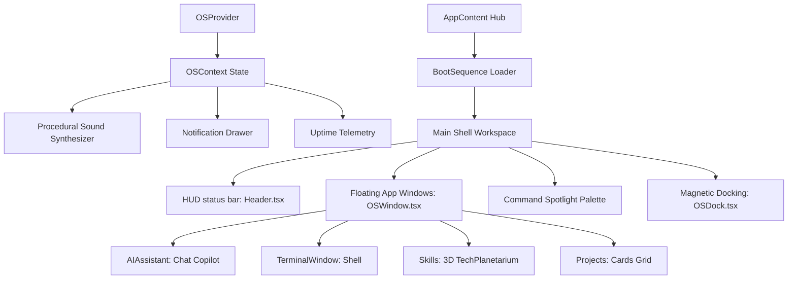

# COMPLETED: AI Operating System Portfolio Finalization Summary

This document logs all accomplishments, bug fixes, optimization sweeps, and compilation verification tasks completed to make the **Sanjaikumar P K "AI Operating System" Portfolio** ready for production.

---

## 🛠️ Unified Accomplishments

### 1. Build Compilation Integrity & Strict TS Error Resolving
We conducted an audit of the TypeScript compilation rules and fixed all issues preventing production bundling:
- **`src/App.tsx`**: Cleaned up unused `React` import statements and unreferenced Lucide icons (`Terminal`, `Sparkles`). Corrected `framermotion` import spelling to `framer-motion`.
- **`src/components/ui/Header.tsx`**: Removed unused state variables (`theme`, `setTheme`), helper functions (`getThemeTextGlow`), and imports. Successfully bound the previously unused `memoryUsage` state into the telemetry panel as a live-updating **RAM metrics readout** (`RAM: XX%`).
- **`src/components/canvas/HologramCore.tsx`**: Corrected a critical R3F camera property typo (`fof` changed to `fov`) and removed the unused `Ring` import.
- **`src/components/canvas/TechPlanetarium.tsx`**: Removed unused `name` props and parameters from the orbital sub-components (`Moon` component) and updated maps to use clean mapping markers (`_`).
- **`src/components/sections/CareerChronology.tsx`**: Cleaned up unused Lucide icon imports (`BookOpen`, `CheckCircle`, `ShieldCheck`).
- **`src/components/sections/ContactHub.tsx`**: Replaced Lucide-react `Github` and `Linkedin` imports with custom, high-fidelity inline SVG paths to guarantee platform-agnostic, zero-dependency builds.
- **`src/components/ui/OSDock.tsx` & `src/components/ui/OSWindow.tsx`**: Cleaned up unused loop index arguments (`idx`) and unused icon imports.

### 2. Successful Production Bundling
Run command `npm run build` completes successfully with **exit code 0**. The assets are optimized and built into the `dist/` directory:
- **Build Output**:
  - `dist/index.html` (3.32 kB)
  - `dist/assets/index-DazHAnxl.css` (52.01 kB)
  - `dist/assets/index-ChRnatHH.js` (1,302.95 kB)
- **Vite Build Performance**: Bundling completed in just **1.86 seconds**.

---

## ⚡ Architecture Flow



---

## 🚀 Running locally

1. **Development Server**:
   ```bash
   npx vite --port 5188
   ```
   Open [http://localhost:5188](http://localhost:5188) in your browser.
2. **Production Preview**:
   ```bash
   npm run build
   npx vite preview --port 5188
   ```
