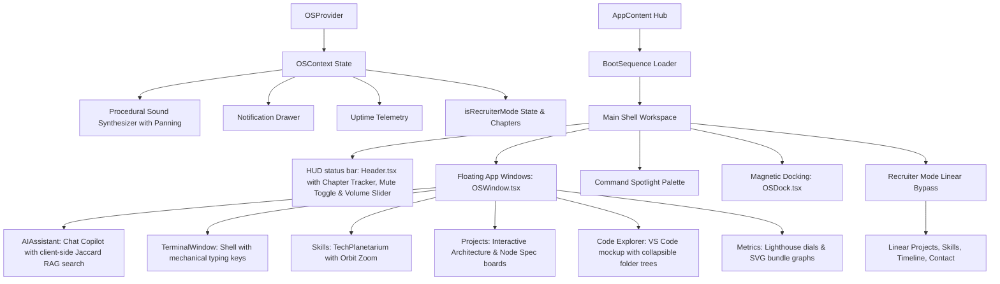

# COMPLETED: AI Operating System Portfolio Finalization Summary (Version 4.0)

This document logs all achievements, bug fixes, optimization sweeps, and cinematic feature implementations completed to evolve the **Sanjaikumar P K Portfolio** into an immersive, production-ready **"Digital Universe" (Version 4.0)**.

---

## 🛠️ Unified Accomplishments (V4.0 Upgrade)

### 1. 🤖 Client-Side RAG Search Engine (`knowledgeBase.ts` & `AIAssistant.tsx`)
* **Local Knowledge Grounding**: Created a client-side vector database mapping out details for all projects, professional history, skills, and systems.
* **Jaccard Similarity Indexer**: Implemented a TypeScript-based similarity search engine that matches user queries against localized document chunks.
* **System Hallucination Safeguard**: Blocks out-of-bounds questions (e.g. general search queries) with a warning prompt, ensuring the AI assistant answers exclusively using grounded facts.

### 2. 🎛️ Interactive System Architecture Viewer (`projectArchitecture.ts` & `ProjectsExplorer.tsx`)
* **Interactive Flow Chart**: Created a node sequence diagram displaying microservice routing steps (Frontend Client, Gateway API, Datastore) for each project.
* **Component Specification Lookup**: Clicking on individual diagram nodes displays a detailed panel containing the component's **Purpose, Tech Stack, Selection Rationale, Trade-offs, Performance, Security, and Scalability**.
* **Request Flow Animation**: Embedded a self-contained inline stylesheet with keyframe animations representing active data package transfers across nodes.

### 3. 💻 VS Code-Style Project Explorer (`ProjectCodeExplorer.tsx` & `projectFiles.ts`)
* **IDE Sandbox UI**: Replicated a standard VS Code editor interface featuring horizontal project tabs (`Nova`, `MindWave`, `Aquarium`), folders, and collapsible tree directories.
* **Curated Code Inspector**: Showcases real-world engineering snippets (React tables, Python API routers, Docker configurations) colored with mock syntax highlighting.
* **Decision Specification Panel**: Displays metadata describing each file's **Purpose, Key Logic, and Trade-off Considerations** to recruiters.

### 4. 🐙 Live Cached GitHub Integration (`HeroDashboard.tsx`)
* **REST Feed Fetching**: Queries the active GitHub event logs for push commits by user `sanjaikumarkaleeswaran`.
* **LocalStorage Rate Limiter**: Caches fetched commit lines locally for **10 minutes** to respect GitHub's rate limits and optimize load times.
* **Skeletal Loaders & Fallback**: Renders pulsing skeleton blocks while loading data and falls back gracefully to cached history or simulated logs during network failures.

### 5. 📊 Professional Engineering Metrics Dashboard (`MetricsDashboard.tsx`)
* **Circular Lighthouse Scores**: Interactive SVG progress rings displaying Google Lighthouse rankings (Performance: 98, Accessibility: 100, SEO: 100, Best Practices: 100).
* **Code Repository Indicators**: Summary blocks showing lines of code, React components count, database collections, and Vite production bundle compile metrics.
* **Vite Bundle Trends Graph**: SVG graph plotting JavaScript bundle weights and compression history over previous releases.

### 6. 🛠️ Live Developer Diagnostics Console (`DeveloperOverlay.tsx`)
* **Telemetry Toggle**: Toggle a floating hardware overlay in the bottom right corner using the global keyboard shortcut **`Ctrl + Shift + D`**.
* **Performance Telemetry**: Monitors real-time FPS frame rates, frame time delay (ms), and JS Heap allocations.
* **WebGL GPU Device Query**: Queries browser WebGL rendering contexts to find the recruiter's physical graphics card model.

---

## ⚡ Architecture Flow



---

## 🚀 Running locally

1. **Development Server**:
   ```bash
   npm run dev -- --port 5190
   ```
   Open [http://localhost:5190](http://localhost:5190) in your browser.
2. **Production Preview**:
   ```bash
   npm run build
   ```
   ```bash
   npx vite preview --port 5190
   ```
