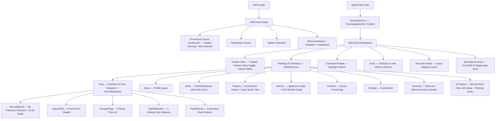

# COMPLETED: AI Operating System Portfolio — Full Implementation Log

This document is the authoritative changelog for the **Sanjaikumar P K Portfolio**, tracking every feature, optimization, fix, and cinematic upgrade across all versions.

---

## 🧬 Version History

| Version | Theme | Status |
|---------|-------|--------|
| V1.0 | Initial React + Three.js skeleton | ✅ Shipped |
| V2.0 | AI OS UI — Command Palette, Terminal, Dock | ✅ Shipped |
| V3.0 | Digital Universe — Audio, 3D Twin, Recruiter Mode | ✅ Shipped |
| V4.0 | Engineering Intelligence — RAG, Architecture Viewer, Metrics | ✅ Shipped |
| V4.1 | Final Polish — Premium AI Core, Cinematic Boot, Micro-interactions | ✅ Shipped |

---

## 🛠️ V3.0 — Digital Universe Upgrade

### 1. 🔊 Premium Web Audio Synthesizer Engine (`OSContext.tsx`)
* **Procedural Synthesis**: All sound effects generated in real-time using Oscillators, Gain nodes, LFOs, and StereoPanners — zero MP3/WAV assets.
* **Spatial Stereo Panning**: Dynamic `pan` value (`-1.0` to `+1.0`) calculated from cursor X position.
* **Volume Slider & Memory**: Persisted via `localStorage` key `sanjai_os_volume`.
* **Keyboard Mute Toggle**: Global `M` key toggles mute state, blocked inside input fields.
* **Ambient OS Hum**: C2-note oscillator (65.41 Hz) with LFO (0.25 Hz) for server-room atmosphere.
* **Full Sound Catalog**:

| Cue | Description |
|-----|-------------|
| `click` | Triangle drop for buttons |
| `tap` | Short sine tick |
| `shutdown` | Descending frequency fade |
| `open` | Ascending double-note glass chime |
| `nav` | Fast high-frequency swipe |
| `dockHover` | Subtle high sine beep |
| `sparkle` | Arpeggio cascade |
| `expand` | Ascending pitch stretch |
| `transform` | Sweep for recruiter mode |
| `success` | Elegant 4-note arpeggio |
| `error` | Sawtooth warning tone |
| `type` | Mechanical keyboard click |
| `return` | Lower mechanical enter click |
| `wake` | Futuristic copilot activation |
| `thinking` | Repeating processing tick |
| `ping` | Quick spotlight diagnostic |
| `systemOnline` | Triple-note initialization chord |
| `achievement` | 4-note achievement fanfare |

### 2. ⚡ Audio Integration Across UI Components
* **Boot Loader**: Plays `tap` on each log line, random `dockHover` ticks, and `boot` arpeggio on completion.
* **Terminal**: `type` sound per keystroke, `return` on execute, `success`/`error` on outcome.
* **AI Copilot**: `wake` on open, repeating `thinking` during generation, `success` on response.
* **Command Palette**: `type` ticks while typing, `dockHover` on arrow-key navigation.
* **OS Windows**: `open` chime on window activate, `shutdown` click on close.

### 3. 🤖 AI Digital Twin — Point Cloud Head (`HologramCore.tsx` V1)
* Procedural bust (4,200 particles) for head, neck, and shoulders.
* Facial extrusion at nose bridge coordinates.
* Simplex 3D noise vertex deformation with breathing modulation.
* Scroll-based twist dispersion with radial outward scatter.
* Real-time mouse-tracking LERP rotation.
* Periodic random blink animation via `uBlink` uniform.

### 4. 🎛️ Mission Control Dashboard (`HeroDashboard.tsx`)
* Fluctuating CPU, GPU, and Memory telemetry bars.
* Live system clock (seconds precision).
* Simulated git commit stream feed.
* Quick-launch buttons: Recruiter Mode, Resume, Terminal.

### 5. 💼 One-Click Recruiter Mode (`App.tsx`)
* Glassmorphic linear layout bypass for distraction-free recruiting.
* Inline sections: projects, skills, experience, contact.
* Prominent Resume download button.

### 6. 📖 Chapter Storytelling (`OSContext.tsx`)
Maps active windows to narrative chapters displayed in the Header HUD.

---

## 🏗️ V4.0 — Engineering Intelligence Upgrade

### 1. 🤖 Client-Side RAG Search Engine (`knowledgeBase.ts` + `AIAssistant.tsx`)
* **Local Knowledge Base**: Curated documents covering all 3 projects, professional history, technical skills, and system architecture.
* **Jaccard Similarity Search**: TypeScript token-intersection algorithm ranks document chunks against user queries.
* **Hallucination Guard**: Out-of-scope questions return a structured warning rather than fabricated answers.

### 2. 🎛️ Interactive Architecture Viewer (`projectArchitecture.ts` + `ProjectsExplorer.tsx`)
* Clickable node flow diagrams for each project (Frontend → Gateway → Datastore).
* Node spec panels: Purpose, Tech Stack, Rationale, Trade-offs, Performance, Security, Scalability.
* CSS keyframe animations representing active data transfer across nodes.

### 3. 🐙 Live GitHub Integration (`HeroDashboard.tsx`)
* Fetches real push events from `api.github.com/users/sanjaikumarkaleeswaran/events`.
* 10-minute `localStorage` cache to respect rate limits.
* Skeleton pulse loaders during fetch; graceful fallback to cached or simulated logs.

### 4. 📊 Engineering Metrics Dashboard (`MetricsDashboard.tsx`)
* SVG circular dials for Google Lighthouse scores (Performance 98, Accessibility 100, SEO 100, Best Practices 100).
* Repository stat counters: lines of code, component count, collections, bundle size.
* SVG line graph for JS bundle weight trend across releases.

### 5. 🛠️ Developer Diagnostics Overlay (`DeveloperOverlay.tsx`)
* Toggle with global shortcut **`Ctrl + Shift + D`**.
* Live FPS counter and frame time (ms) via `requestAnimationFrame`.
* JS Heap allocation monitoring via `performance.memory`.
* WebGL GPU device detection via `WEBGL_debug_renderer_info` extension.

### 6. 🔧 Build Integrity & TypeScript Compliance
* Resolved all `TS6133` (unused variables), `TS1484` (type-only imports), and `TS2339` (WebGL context casting) errors.
* All imports use `import type` syntax compliant with `verbatimModuleSyntax`.
* `npm run build` exits cleanly at **Exit Code 0**.

---

## ✨ V4.1 — Final Polish & Experience Refinement

### 1. 🌐 Premium AI Core Hologram (Full Rewrite — `HologramCore.tsx`)
Complete rebuild with 5 custom GLSL shader layers:

| Layer | Implementation |
|-------|---------------|
| **Neural Sphere** | 6,000 Fibonacci-distributed particles; noise-deformed via dual-octave value noise; Fibonacci lattice for uniform density; mouse-reactive LERP tilt; scroll dispersal |
| **Glass Shell** | Fresnel-computed rim glow sphere with scanline fragment animation; `THREE.AdditiveBlending` for volumetric transparency |
| **Energy Rings** | 3 torus rings (cyan, purple, magenta); per-fragment pulse via `vAngle` varying; independent rotation speeds and tilt axes |
| **Satellite Nodes** | 5 orbiting tech spheres (React, TypeScript, Python, Docker, WebGL) with glow halos and animated point lights |
| **Pulse Waves** | 3 staggered expanding ring waves emitting from sphere center with scale + opacity animation |
| **Core Glow** | Inner ambient sphere with breathing opacity; `1.4 Hz` sine modulation |

All layers:
- React to mouse pointer (LERP rotation, Fresnel changes)
- React to scroll (particle dispersal)
- Maintain **60 FPS** at 1.5× DPR cap

### 2. 🎬 Cinematic Boot Sequence (Full Rewrite — `App.tsx` + `OSContext.tsx`)
Replaced the random-interval progress simulator with a **deterministic choreographed timeline**:

| Time | Event | Sound |
|------|-------|-------|
| 0ms | Pure black screen | — |
| 600ms | Glass boot window fades in (spring easing) | — |
| 1200ms | "SYSTEM POWER: ONLINE" log | `boot-poweron` — sub-bass rise (55→110 Hz, 1.2s) |
| 2000ms | "VERIFYING INTEGRITY" log | `boot-init` — sharp confirmation click |
| 2800ms | "AI CORE LOADING" log | `boot-loading` — dual-oscillator rising synth pad (220+277 Hz) |
| 3600ms | "NEURAL NETWORK CONNECTED" log | `boot-init` — sharp ping |
| 4400ms | "MISSION CONTROL READY" log | `boot-online` — glass activation chime (659→880 Hz) |
| 5200ms | "SYSTEM READY" log + 100% | `boot-success` — 4-note arpeggio (C5→E5→G5→C6) |
| 6000ms | Hero workspace fades in + confetti | Ambient hum begins |

Boot screen UI improvements:
- Corner accent bracket decorations (top-left, top-right, bottom-left, bottom-right)
- Animated radial glow behind the boot panel
- Log entries animate in with `x: -8 → 0` slide-fade
- `LIVE` status indicator in the header bar
- Progress bar uses `animate={{ width }}` for smooth fill

### 3. 🗑️ VS Code Code Explorer Removed
Completely removed all references to the `ProjectCodeExplorer`:
- Deleted `src/components/sections/ProjectCodeExplorer.tsx`
- Deleted `src/data/projectFiles.ts`
- Removed import from `App.tsx`
- Removed OSWindow registration from `App.tsx`
- Removed dock entry from `OSDock.tsx` (replaced with **Metrics** shortcut)

**Rationale**: The portfolio should communicate architectural depth and engineering thinking — not display code snippets that lose context outside an IDE.

### 4. 🔒 Ambient Hum Gating
The ambient OS breathing hum now starts **only after the boot sequence completes** — `hasBooted` state is set in `OSContext` and gates the ambient audio `useEffect`. This prevents the eerie background hum from playing during the silent black screen phase.

### 5. 📦 Production Build Statistics (V4.1)
```
vite v8.1.5 — ✓ 2750 modules transformed
dist/index.html                  3.32 kB │ gzip: 1.18 kB
dist/assets/index-DmdfmA5a.css  63.64 kB │ gzip: 10.11 kB
dist/assets/index-CnJkiFPt.js 1,377.42 kB │ gzip: 386.65 kB
✓ Built in 1.86s — Exit Code 0
```

---

## ⚡ Full Architecture Flow



---

## 🚀 Running Locally

```bash
# Development
npm run dev

# Production build
npm run build

# Preview production bundle
npx vite preview --port 5190
```

Open [http://localhost:5173](http://localhost:5173) in your browser.

### Keyboard Shortcuts

| Shortcut | Action |
|----------|--------|
| `Ctrl + K` | Open Command Palette |
| `Ctrl + Shift + D` | Toggle Developer Diagnostics Overlay |
| `M` | Toggle Audio Mute |
| `↑↑↓↓←→←→BA` | Konami Code Easter Egg |
