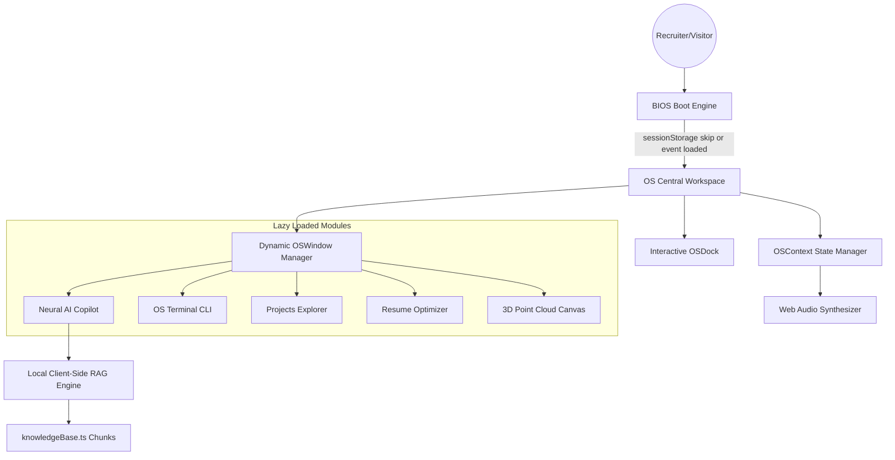

# 🌌 AI Operating System Portfolio V7.0

An immersive, high-performance, cinematic developer portfolio styled as a futuristic point-of-care **AI Operating System (OS)**. Built with React, TypeScript, and TailwindCSS, it features an interactive point-cloud twin visualizer, procedural audio, local client-side retrieval-augmented generation (RAG), and a suite of interactive developer utilities.

---

## 🚀 Key Performance Indicators (FCP & TTI Targets)

The system has been engineered to load almost instantly while maintaining an engaging visual experience:

*   **Initial Script Bundle:** **~48.50 kB** (gzipped: 12.10 kB) — Heavy components (`Three.js`, `Framer Motion`, and sections) are code-split into dynamic async chunks.
*   **Parallel Boot Engine:** The BIOS animation runs on real event-driven loading milestones (fonts, avatar image resolution) instead of artificial timers.
*   **Idle Prefetch Queue:** Chunks are pre-fetched during CPU idle time using `requestIdleCallback` so they respond instantly when loaded.
*   **Session Persistence:** Detects returning visits using `sessionStorage` and skips the boot screen, directing users to the workspace immediately.
*   **FPS Target:** 60 FPS transitions using hardware-accelerated transforms (`will-change`).

---

## 🛠️ Tech Stack & Architecture



*   **Core:** React 19 + TypeScript + Vite (Single Page Application).
*   **Styling & Motion:** TailwindCSS + Framer Motion (Optimized for composite layers).
*   **Graphics & Audio:** Three.js (3D Particle Hologram) + Web Audio API (procedural synthesizer oscillator cues).
*   **AI Stack:** Client-side RAG parser calculating similarity density.
*   **Containerization & Deployment:** Docker / Multi-stage Dockerfile ready.

---

## ✨ Immersive Modules

### 1. Neural AI Copilot (Local RAG)
An interactive AI assistant operating completely client-side. The assistant leverages a custom Jaccard density tokenizer to search matching records from the portfolio's knowledge base, delivering contextual summaries while guarding against hallucination via safety safeguards.

### 2. Resume Capability Optimizer
A recruiter utility allowing users to paste target Job Descriptions. The system runs a local keyterm matching algorithm, rates resume alignment compatibility, and offers one-click downloads for **tailored JSON** or **printable CV templates**.

### 3. OS Terminal CLI
A fully interactive console supporting operational directives. Commands include:
*   `help` - List operational instructions.
*   `skills` / `projects` / `experience` / `education` - Decrypt candidate database fields.
*   `theme [name]` - Adjust OS theme (matrix, blueprint, recruiter, glass, etc.).
*   `system` - Check memory uptime and WebGL GPU diagnostics.

### 4. Tech Planetarium (3D Point Cloud)
A holographic point twin visualizer built with Three.js rendering customizable point clusters that respond to mouse interactions and window size.

---

## 📦 Installation & Setup

1.  **Clone the Repository:**
    ```bash
    git clone https://github.com/sanjaikumarkaleeswaran/Sanjaikumar_Portfolio.git
    cd Sanjaikumar_Portfolio
    ```

2.  **Install Dependencies:**
    ```bash
    npm install
    ```

3.  **Start Development Server:**
    ```bash
    npm run dev
    ```

4.  **Production Compilation:**
    ```bash
    npm run build
    npm run preview
    ```

---

## 🐳 Docker Deployment

The application includes a optimized multi-stage build:

1.  **Build Docker Image:**
    ```bash
    docker build -t sanjai-portfolio:latest .
    ```

2.  **Run Container:**
    ```bash
    docker run -d -p 8080:80 sanjai-portfolio:latest
    ```
    *Accessible via http://localhost:8080*

---

## 🎓 Academic Credentials

*   **Degree:** Bachelor of Science in Software Systems (3-year course)
*   **Institution:** Kongu Engineering College, Erode, Tamil Nadu, India
*   **Duration:** 2021 – 2024
*   **Academic Standing:** CGPA 8.05 / 10 (First Class Honors, No Arrears)
